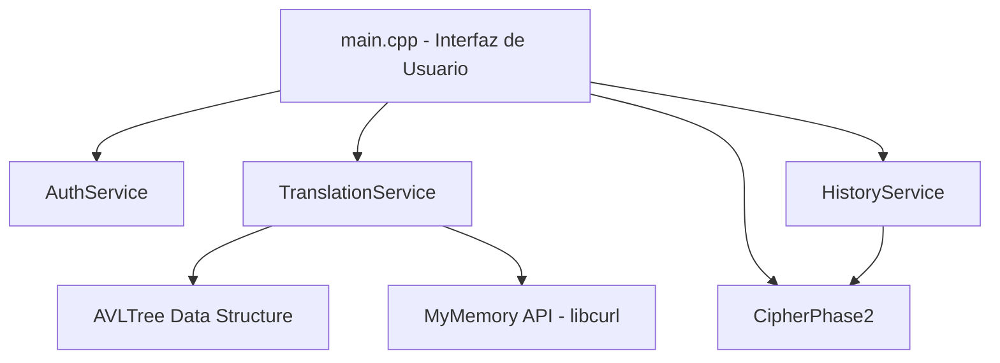
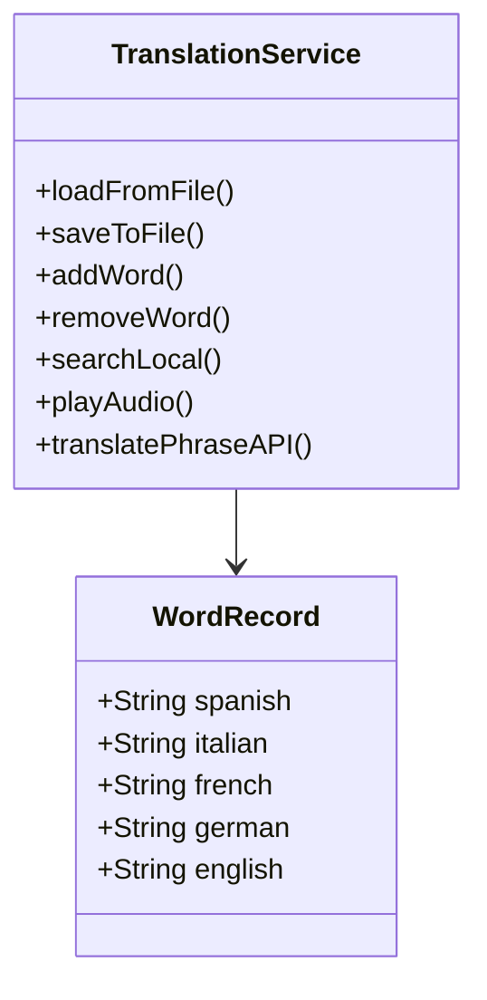
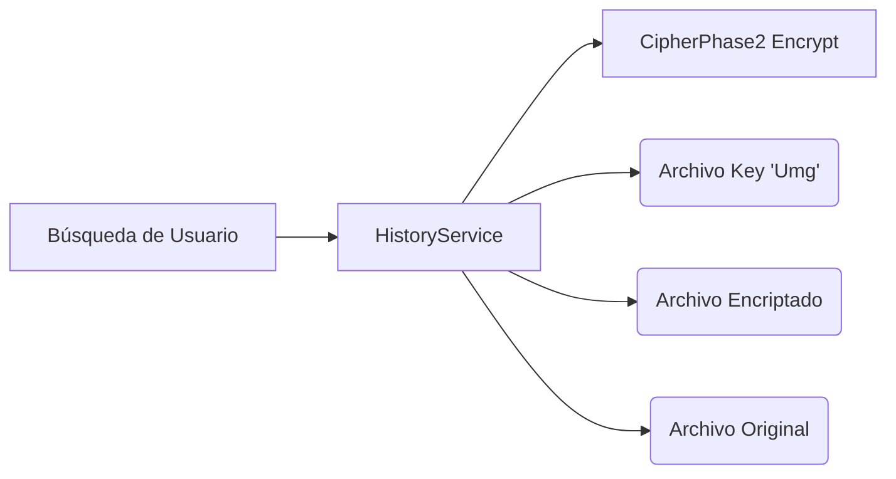

# Documentación del Proyecto: Traductor Definitivo

El proyecto está construido en C++17 utilizando una arquitectura de capas (MVC inspirado) donde se separan claramente los servicios, modelos y la vista (menú interactivo en consola).

## Diagrama de Arquitectura General

## Fase 1: Proceso de Captura y Definición de Datos

**Objetivo:** Crear una aplicación que lea palabras, permita administrar nodos de traducciones y reproducir el audio.
**Lógica Implementada:**
- Se creó `WordRecord` (Modelo) que contiene la palabra en español (llave) y sus traducciones (italiano, francés, alemán e inglés).
- `TranslationService` maneja la carga y guardado local del diccionario desde/hacia archivos de texto.
- Se integra la API de `MyMemory` haciendo llamadas HTTP GET usando `libcurl` y parseando el JSON resultante con `nlohmann/json`.
- La reproducción de audio se realiza a través de llamadas al sistema (comando `say` de macOS) especificando distintas voces por idioma.

## Fase 2: Diseño Lógico (Árbol AVL y Encriptación Umg)

**Objetivo:** Usar Árbol AVL para búsqueda y carga, guardar historial y encriptar las palabras de búsqueda.
**Lógica Implementada:**
- **Estructura AVL:** La clase `AVLTree` y `Node` manejan el balanceo automático (rotaciones izquierda/derecha) para garantizar un tiempo de búsqueda $O(\log n)$.
- **Encriptación (CipherPhase2):** Se implementó una clase estática que utiliza un mapeo predefinido en base a las reglas solicitadas:
  - Vocales (a->U1 ... u->U5).
  - Consonantes minúsculas (b->m1 ... z->m22).
  - Consonantes mayúsculas (B->g1 ... Z->g22).
- **Historial (HistoryService):** Cada vez que se busca una palabra (localmente o en API), se encripta y se generan los 3 archivos solicitados dentro del directorio del usuario (`data/username/history/`):
  1. `_key.txt` conteniendo "Umg".
  2. `_enc.txt` conteniendo el resultado encriptado.
  3. `_orig.txt` conteniendo la información original.
- Para sacar el "Top de Palabras", se lee el historial de archivos originales del usuario y se cuentan sus ocurrencias usando un `std::map`.

## Fase 3: Seguridad y Confidencialidad (Usuarios y Archivos Propios)

**Objetivo:** Perfiles de usuario, restringir accesos y evitar modificaciones externas creando un tipo de archivo propio.
**Lógica Implementada:**
- Se creó `AuthService` que gestiona el login y registro. Los usuarios se guardan en `/data/users/`.
- **Restricción y Encriptación de Archivos:** Cada usuario tiene su propio diccionario llamado `username.traddb`.
- **Tipo de Archivo Propio (`.traddb`):** 
  - La primera línea es un *Magic Number* `TRAD` para validar que el archivo fue generado por la aplicación y evitar inyecciones.
  - El contenido de todo el diccionario personal está encriptado línea por línea utilizando el mismo proceso de la Fase 2 (CipherPhase2). Esto restringe la vista y modificación externa de los registros.
- Al iniciar sesión, la memoria se carga desencriptando el archivo y al cerrar, se vuelve a encriptar y guardar.
